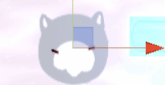
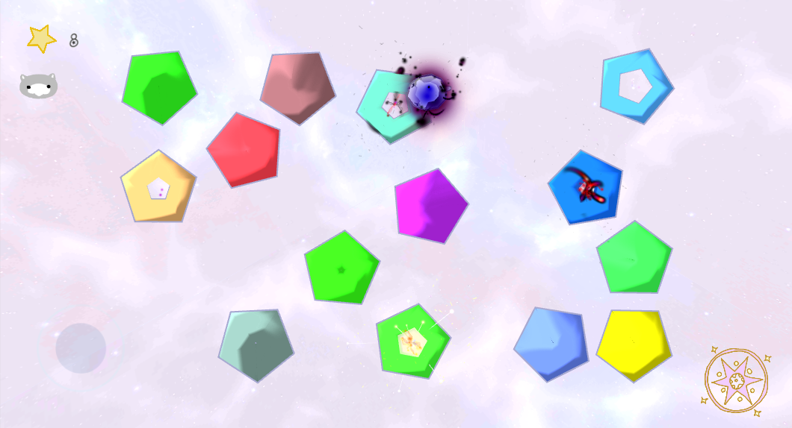
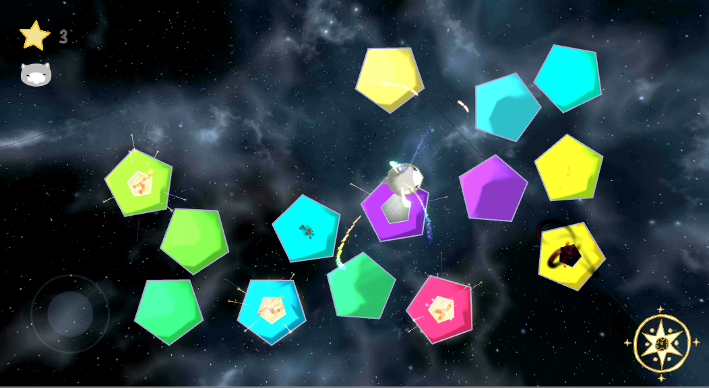
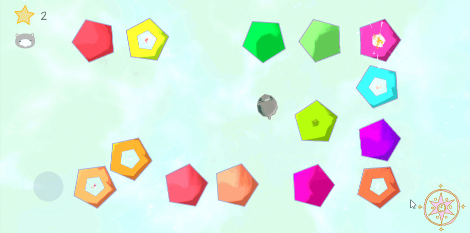

# Eminence

Arcade game for Android

## Meet Dobty
This is Dobty being excited in Unity3D's editor  
  

Dobty is a young blob deity who wants to grow into a shiny Eminence.  
In the Portal Grounds, Dobty can feed on blessings and become shinier.  
But beware! Not all things that come through the Portal Grounds are blessings...  

## Current Published Version: v0.4
## [Download from Google Play here](https://play.google.com/store/apps/details?id=com.Tuttlebird.Eminence)
## [Download the Android APK here](https://drive.google.com/file/d/1O5LIX_DJVPuWBz3Tm9bDPWQOxiZA8G1G/view?usp=sharing)  
## [Download .zip for PC here](https://drive.google.com/file/d/1MyxJOlG65PWLV3JdLTMEwofCy1k_a4Ya/view?usp=sharing)
For PC build: unzip and run Eminence to play.  
  

## Features

A Sample of (Poor) Gameplay

Toggle between Light and Dark theme, anytime.  
  
  

Two Gameplay Modes: Endless and Survival

Achievements system: Highscore  
- will add completion and point target achievements ~~as soon as I'm done my homework~~ soon  

Main Menu Options 
  
- toggle theme
- toggle game mode
- check achievements
- (coming soon) audio options

Pause Game and Return-To-Menu (Dobty needs a break) Options

## Coming Soon
- audio background options: normal theme, quiet theme, silent
- dobty audio noises options: (currently turned off) - turn on happy/sad sounds when gaining/losing points/HP
- more achievements

## Known Issues
**v0.3**: "Current Score" in Game Mode's Pause/Options menu only updates the first time the menu is opened  

**v0.4 - CURRENT VERSION**: None... YET... 

## A Note About This Repo
- this repo contains ONLY scripts written for the game **by me**
- this repo does NOT contain assets
- this repo does not contain scripts from external assets

## Credits
Dobty, the portals, the audio, and some other stuff were made by me.  
All external assets were either purchased or free for non-commercial use.  

The following Unity Store Assets were used or referenced in some way:  
[Particle Ribbon by Moonflower Carnival](https://assetstore.unity.com/packages/vfx/particles/spells/particle-ribbon-42866)  
[UJoystick by Lovatto Studio](https://assetstore.unity.com/packages/tools/input-management/ujoystick-49186)  
[Toon Shader Free by Ippokratis Bournellis](https://assetstore.unity.com/packages/vfx/shaders/toon-shader-free-21288)  
[MK Glow Free by Michael Kremmel](https://assetstore.unity.com/packages/vfx/shaders/fullscreen-camera-effects/mk-glow-free-28044)

Some of the UI is adapted from Giphy stickers:  
[Good Vibes Love Sticker by Nora Fikse](https://giphy.com/stickers/by-nora-bynorafikse-62bZqi1DwCPy6jyYxJ)  
[Summer Fun Sticker](https://giphy.com/stickers/summer-sun-bysummer-YMk5AJhusglR8goPuk)  
[Happy Fun Sticker](https://giphy.com/stickers/night-moon-planet-lwqCF9DRCHfboaWQdM)  
[Arrow Pfeil Sticker By Alycia Marie](https://giphy.com/stickers/alyciamarie-arrow-pfeil-alycia-marie-Me81mOdZvTtHtAjTAa)  

Game font is from:  
[Janga Silly Monkey by Kimberly Geswein](https://www.1001freefonts.com/janda-silly-monkey.font)

